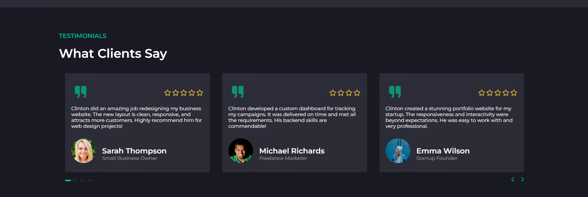

## 1. Hi there 👋

Aspiring Junior Web Developer with hands-on experience in front-end and back-end web technologies such as
HTML, CSS, JavaScript, React.js, Node.js, and MySQL. Proven ability to create responsive and user-friendly
websites. Currently enhancing web design and development skills through coursework at Minnesota State
University Moorhead and project-based learning from Cengage (MindTap).

Live demo: [my portfolio](https://clinton-fezeu.github.io/my-portfolio/)

